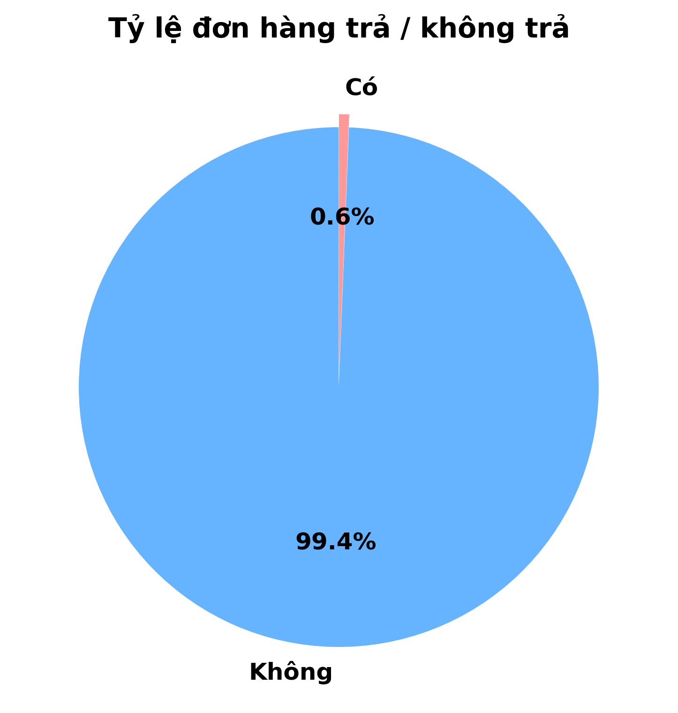
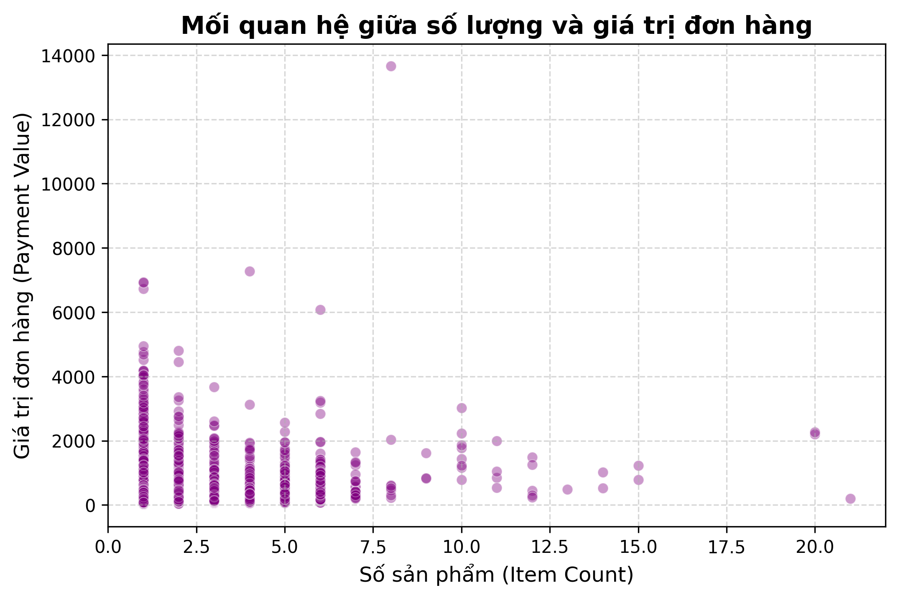
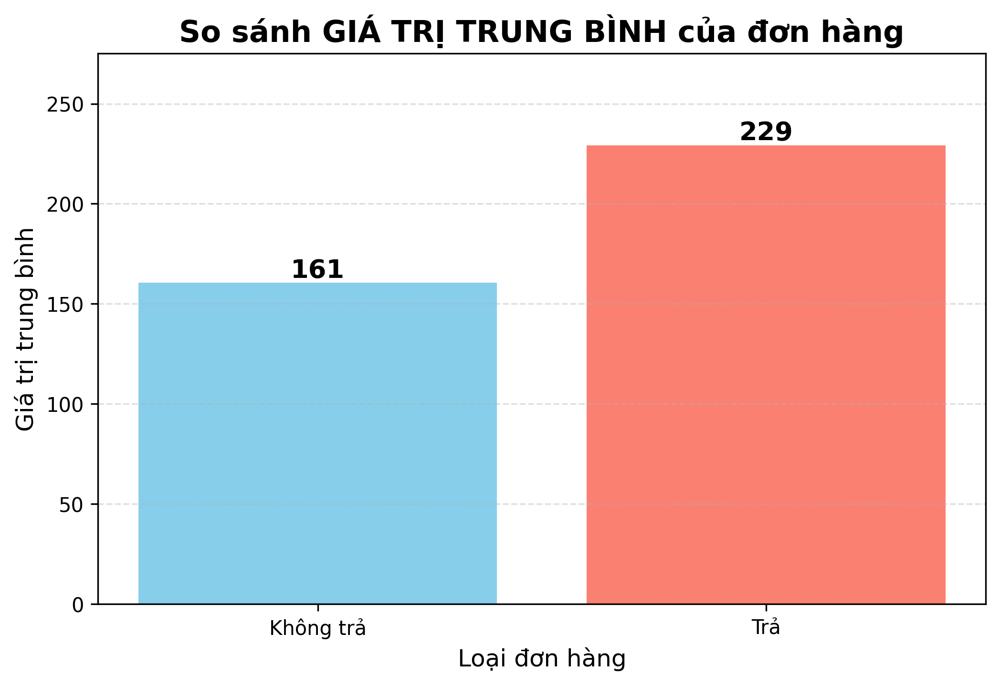
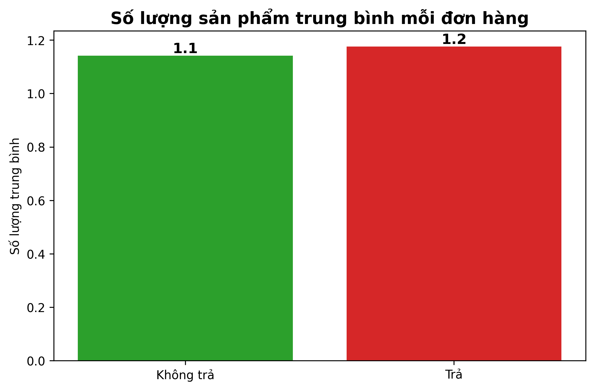
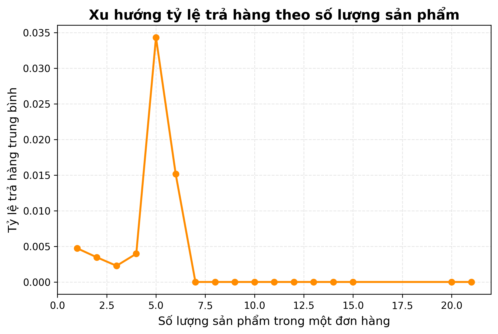
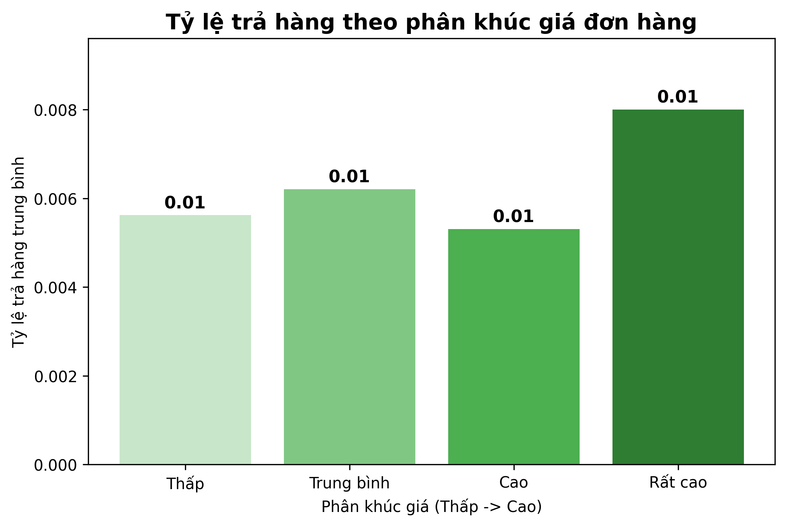
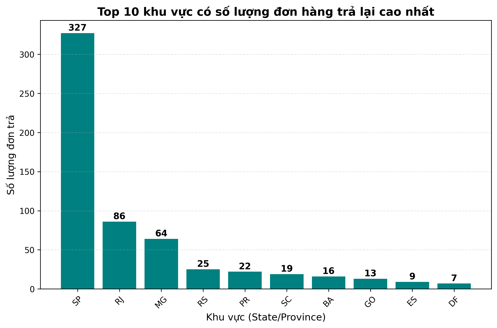
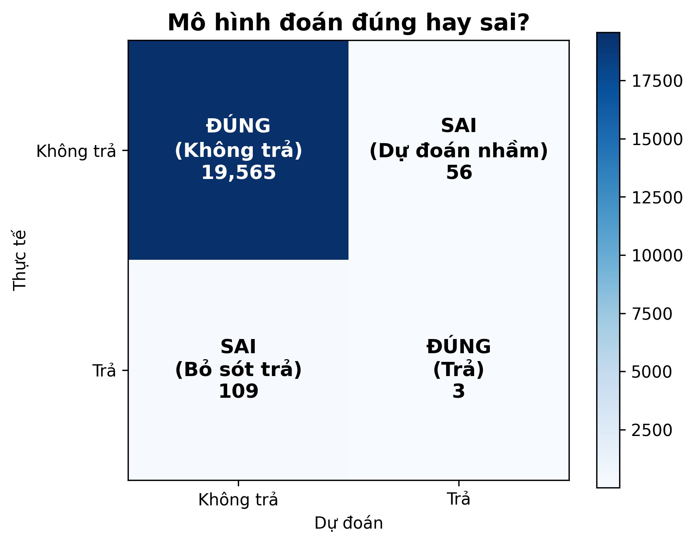
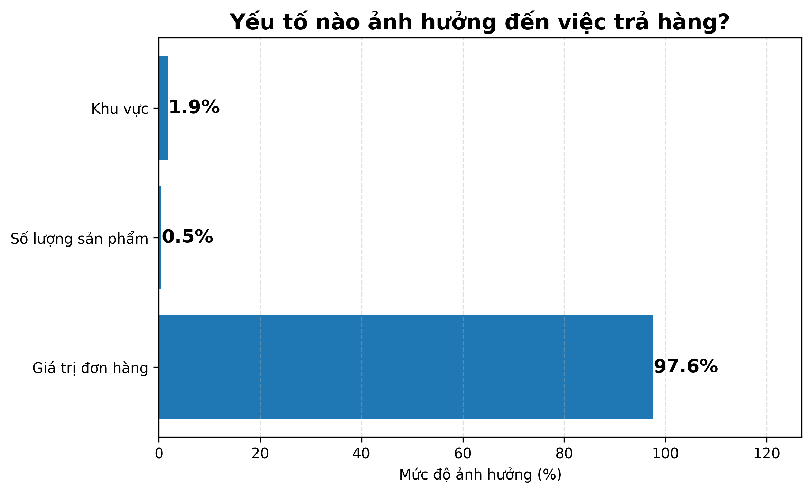

# 📦 Dự án Phân tích & Dự báo Trả hàng (E-commerce Returns)

## 📝 Giới thiệu
Dự án này tập trung vào việc phân tích hành vi mua sắm của khách hàng trong lĩnh vực Thương mại điện tử. Mục tiêu chính là xác định các yếu tố dẫn đến việc **trả hàng (Return Orders)** và xây dựng mô hình Machine Learning để dự báo rủi ro hoàn hàng.

---

## 📊 Kết quả Phân tích Trực quan (10 Biểu đồ)

### 1. Phân phối Đơn hàng
Nhóm dữ liệu cho thấy tỷ lệ đơn hàng bị trả lại chiếm một phần đáng kể, đòi hỏi các biện pháp tối ưu hóa vận hành.
| Số lượng Đơn hàng | Tỷ lệ Phần trăm (%) |
|---|---|
|  |  |

### 2. Phân tích Giá trị & Số lượng Sản phẩm
Chúng ta so sánh sự khác biệt giữa các đơn hàng thành công và đơn hàng bị trả lại để tìm ra quy luật.
- **Tương quan:** Biểu đồ Scatter Plot giúp phát hiện các điểm dữ liệu bất thường (Outliers).

| Giá trị đơn hàng TB | Số lượng sản phẩm TB |
|---|---|
|  |  |

### 3. Xu hướng và Phân khúc Giá
- **Xu hướng:** Tỷ lệ trả hàng thay đổi rõ rệt khi số lượng sản phẩm trong đơn tăng lên.
- **Phân khúc:** Các đơn hàng ở phân khúc giá cao thường có rủi ro hoàn trả khác biệt so với hàng giá rẻ.
| Theo Số lượng | Theo Phóm giá |
|---|---|
|  |  |

### 4. Phân tích Địa lý & Đánh giá Mô hình
Xác định "điểm nóng" (hotspots) trả hàng theo khu vực và kiểm tra độ chính xác của mô hình dự báo.
| Top Khu vực trả hàng | Ma trận nhầm lẫn (Model Evaluation) |
|---|---|
|  |  |

### 5. Yếu tố ảnh hưởng chính (Feature Importance)
Đây là các yếu tố quan trọng nhất mà mô hình sử dụng để đưa ra quyết định dự báo.

---

## 💡 Kết luận & Đề xuất (Insights)
1. **Giá trị đơn hàng:** Các đơn hàng có giá trị cực cao có xu hướng... (bạn có thể điền thêm nhận xét dựa trên biểu đồ).
2. **Khu vực:** Cần tập trung cải thiện dịch vụ tại các khu vực có tỷ lệ hoàn trả cao nhất.
3. **Mô hình:** Với ma trận nhầm lẫn, mô hình đang hoạt động tốt ở việc nhận diện các đơn hàng...

## 🛠 Công cụ sử dụng
- **Ngôn ngữ:** Python 3.x
- **Thư viện:** Pandas, Matplotlib, Seaborn, Scikit-learn
- **Môi trường:** Google Colab

---
*Dự án thực hiện bởi [lkbdayyy](https://github.com/lkbdayyy)*
