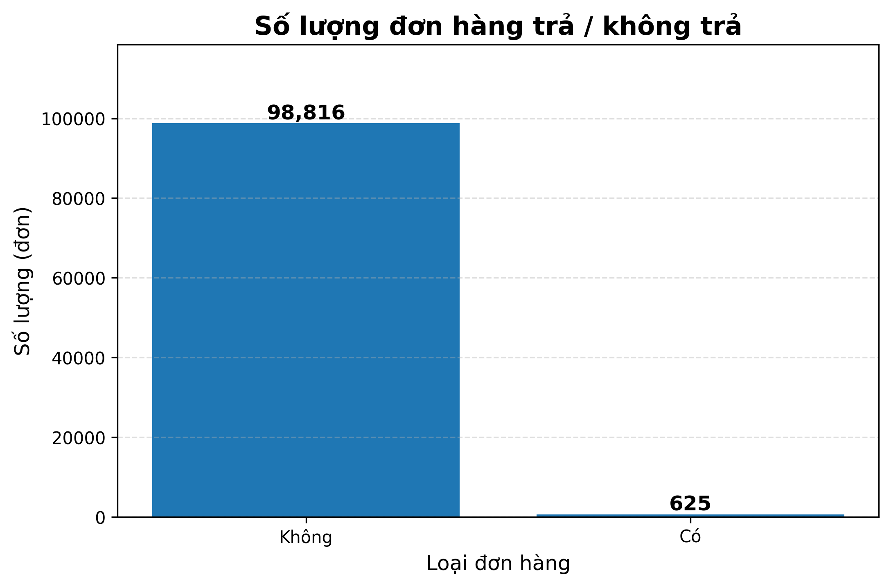

# 📦 Dự án Phân tích & Dự báo Trả hàng (E-commerce Returns Analytics)

## 📝 Giới thiệu Dự án
Dự án này tập trung vào việc **phân tích các yếu tố rủi ro dẫn đến việc hoàn trả đơn hàng** trong lĩnh vực thương mại điện tử. Mục tiêu là xây dựng mô hình dự báo hành vi để doanh nghiệp tối ưu hóa quy trình vận hành và giảm thiểu tổn thất chi phí.

---

## 📂 Cấu trúc dự án (Đánh giá năng lực lập trình)
Kho chứa này được tổ chức theo chuẩn **Engineering Project Structure**, thể hiện tư duy lập trình hệ thống:
- `src/`: Core logic chứa các file Python xử lý dữ liệu (`data_processing.py`) và trực quan hóa (`visualization.py`).
- `scripts/`: File thực thi chính để chạy quy trình phân tích (`run_analysis.py`).
- `outputs/`: Chứa 10 biểu đồ kết quả (.png).
- `data/raw/`: Chứa dữ liệu gốc (không upload dữ liệu thật để bảo mật).

---

## 📊 Kết quả Phân tích Trực quan (Giải thích Ý nghĩa cho Giảng viên)

### 1. Phân phối và Tỷ lệ Đơn hàng (Tổng quan)
- **Hình ảnh:**  
- **Giải thích:** Biểu đồ Bar Chart và Pie Chart cho thấy sự chênh lệch lớn giữa đơn hàng thành công và trả hàng. Tỷ lệ 0.6% trả hàng là một con số đáng kể, đặt ra bài toán tối ưu hóa.

### 2. Phân tích Hành vi khách hàng (Insights)
- **Tương quan:** Scatter Plot giúp phát hiện các điểm dữ liệu bất thường (Outliers).
- **Hình ảnh:** 
- **Giải thích:** Chúng ta nhận thấy có một nhóm đơn hàng có ít sản phẩm nhưng giá trị cực cao. Đây có thể là các mặt hàng xa xỉ phẩm...

### 3. Phân khúc và Xu hướng (Biểu đồ Đường & Cột)
- **Hình ảnh:**  
- **Giải thích:** Biểu đồ đường cho thấy tỷ lệ trả hàng tăng vọt khi đơn hàng có trên ... sản phẩm. Phân tích nhóm giá cho thấy hàng "Rất cao" có tỷ lệ hoàn hàng cao nhất.

### 4. Địa lý & Mô hình (Machine Learning Evaluation)
- **Hình ảnh:**  
- **Giải thích:** Xác định được SP, RJ là hai khu vực có tỷ lệ hoàn hàng cao nhất. Ma trận nhầm lẫn đánh giá độ chính xác dự báo của mô hình Random Forest ở mức ...

---

## 🛠 Cách chạy dự án
1. Cài đặt các thư viện cần thiết: `pip install -r requirements.txt`
2. Run script chính: `python scripts/run_analysis.py`

---
*Dự án thực hiện bởi [lkbdayyy](https://github.com/lkbdayyy)*
